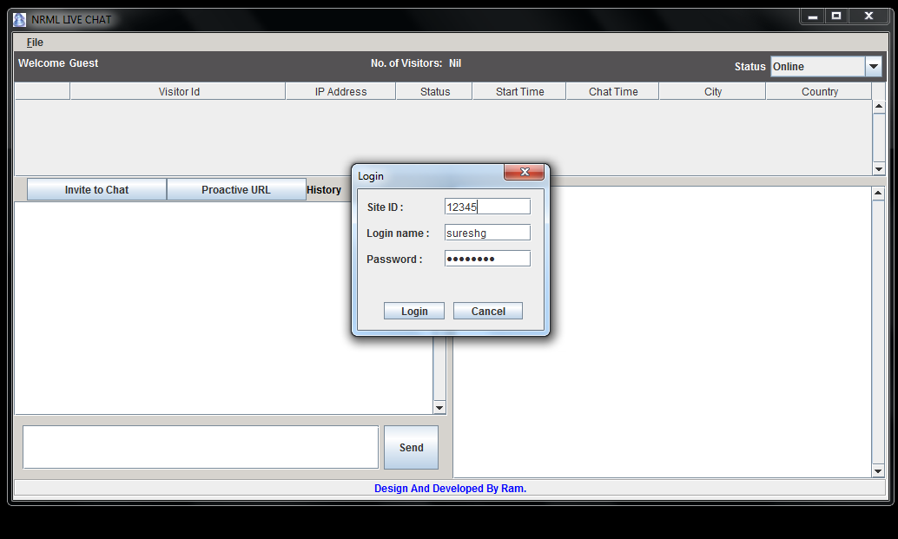
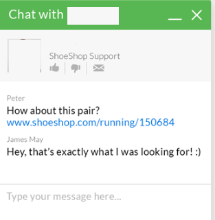

#  Website Visitor to Site Operator Realtime conversation tool

web live chat on any website allows operators to have real-time conversations with their customers.
The first thing you have to do is to install live chat desktop software written in JAVA. Then operators form Desktop/Laptop can start  conversations with any visitors visiting their website.

